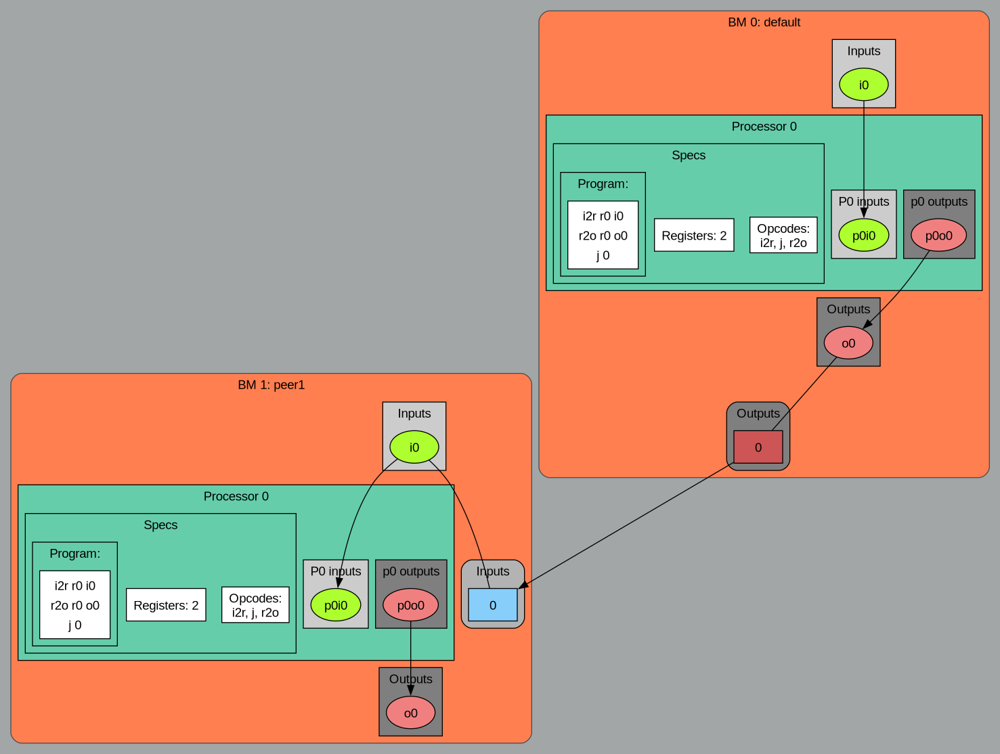

# Basys3 Switches pilot other FPGA LEDs

This example is the distributed variant of the [switchled](../../basic/switchled) example. It demonstrates how two FPGAs can interact with each other through the bondirect protocol and participate in the same architecture. In this case, the switches on one FPGA pilot the LED on the other FPGA.

Let's follow the original (non-distributed) example and see which are the differences.

The architecture is composed of two CPUs. The first CPU (cpu1) is connected to the switches, while the second CPU (cpu2) is connected to the LEDs. The bondmachine connects the two CPUs, allowing cpu1 to read the switch states and send them to cpu2, which then controls the LEDs accordingly. The difference here is that cpu1 and cpu2 are on different FPGAs, unlike the original example where both CPUs were on the same FPGA.

The code of both processors is the same, and the same of the original example, it is contained in the `test.basm` file:
and is as follows:

```asm
%section code .romtext iomode:async
  entry _start    ; Entry point
_start:
  mov r0,i0
  mov o0,r0
  j _start
%endsection
```

In the meta-attributes, contained in the `test.bmeta` file, we can see the differences that make this example distributed.
The cpu2 is defined as a device called `peer1`, with a specific device ID, indicating that it is located on a different FPGA. This simple action of assigning a device to cpu2 makes the architecture distributed.
Indeed, the meta-attributes used are contained in the `test.bmeta` file and are as follows:

```asm
%meta cpdef	cpu1	romcode: code
%meta cpdef	cpu2	romcode: code
%meta cpdef	cpu2	device: peer1, devid:1
%meta bmdef	global  registersize:8, mapclk:clk, mapreset:btnC

%meta ioatt	testio3 cp: bm, index:0, type:output, mapfrom:0, mapto:7, mapname: led1
%meta ioatt	testio3 cp: cpu2, index:0, type:output

%meta ioatt	testio2 cp: cpu1, index:0, type:output
%meta ioatt	testio2 cp: cpu2, index:0, type:input

%meta ioatt	testio1 cp: bm, index:0, type:input, mapfrom:0, mapto:7, mapname: sw
%meta ioatt	testio1 cp: cpu1, index:0, type:input
```

Also the local.mk file is slightly different, as it contains the definition of the bondirect mesh network, which is used to connect the two FPGAs. It also contains the definition of the cluster, which is used to define the two FPGAs as part of the same architecture. In this particular case, the cluster is directly created by basm.

The relevant section is as follows:

```bash
BASM_ARGS=-create-mapfile basys3_maps.json
CLUSTER_SPEC=cluster.json
USE_BONDIRECT=true
BONDIRECT_MAPFILE=edgenode_maps.json
BONDIRECT_MESH=james.json
CLUSTER=true
```

The meshfile `james.json` defines the mesh network for the `james` prototype, in case you want to use a different mesh, you can create your own meshfile.

The example, and the cluster can be summarized with the following diagram:



the example can be build and run using the following commands within the `basys3_dualswitchled` directory:

```bash
make clusterprogram
```

After programming the FPGAs, you can toggle the switches (only the first 8 switches) on the first Basys3 board, and the corresponding LED should light up according to the switch's state on the second Basys3 board.
