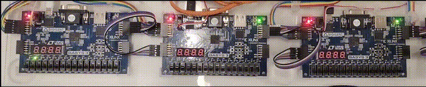

# Basys3 Supercar Multi Board Example

This example is similar to the Basys3 Supercar Single Board Example, but it demonstrates how to use multiple BondMachine cp units to create a more complex optical effect with the leds of more than one Basys3 board.

In this example, we will create an optical effect where a single led moves from left to right and back again across two (or more) Basys3 boards connected together. The name of the example is *supercar_multi* in honor of the famous car from the TV series Knight Rider.

The connection between the two Basys3 boards is done using the PMOD connectors and the *bondirect* protocol provided by the BondMachine project. The basm code for the two cp units is similar to the single board example, but with some modifications to handle the communication between the two cp units. The code is the following (this is the code for the first cp unit, the one on the left, the others cp units code is similar):

```asm
%section kittleft .romtext iomode:sync
    entry _start    ; Entry point
_start:
    rsets16 r3,1 ; initial led position, r3 holds the led pattern as 16 bit register
    rsets16 r4,0 ; direction - 0=left , otherwise=right
wait:
    rsets16 r0, 3000 ; wait time1
    rsets16 r1, 1000 ; wait time2
    call8s sleep ; call sleep from the library
    jz r4, goingl ; check direction and jump accordingly
goingr:
    cir r3 ; shift right
    jz r3, setl ; if r3 is zero, set direction to left
    j print
setl:
    r2o r3, o0
    mov o1, r4 ; send a message to the board at the right
    mov r4, i0 ; wait for a message from the board at the right
    rsets16 r4,0 ; set direction to left
    rsets16 r3,1 ; set r3 to first led
    j print
goingl:
    cil r3 ; shift left
    jz r3, setr ; if r3 is zero, set direction to right
    j print
setr:
    rsets16 r4, 1 ; set direction to right
    rsets16 r3, 32768 ; set r3 to last led
    j print
print:
    r2o r3, o0
    j wait
%endsection
```

The relevant differences with the single board example are the use of the `o1` and `i0` ports to send and receive messages between the two cp units. When the led reaches the end of the first board (the right), it sends a message to the second board to start the led movement on the second board and waits for a message back when the led reaches the end of the second board (the left).
So the leftmost board code sends a message to its right neighbor and waits for a message back, while the rightmost board code sends a message to its left neighbor and waits for a message back. There can be more than two boards connected in a chain, and the same logic applies to each board with the addition of a central board that has both left and right neighbors.

The basm metadata tag the cp units to the FPGA:

```asm
%meta cpdef cpu1 romcode: kittleft
%meta cpdef cpu2 romcode: kittright, device:peer1, devid:1

%meta bmdef global registersize:16, mapclk:clk, mapreset:btnC

%meta ioatt testio1 cp: bm, index:0, type:output, mapfrom:0, mapto:15, mapname: led
%meta ioatt testio1 cp: cpu1, index:0, type:output

%meta ioatt testio2 cp: bm, index:1, type:output, mapfrom:0, mapto:15, mapname: led
%meta ioatt testio2 cp: cpu2, index:0, type:output

%meta ioatt testio3 cp: cpu1, index:1, type:output
%meta ioatt testio3 cp: cpu2, index:0, type:input

%meta ioatt testio4 cp: cpu2, index:1, type:output
%meta ioatt testio4 cp: cpu1, index:0, type:input
```

The `local.mk` file for this example contains the necessary configuration to build the project for multiple Basys3 boards using the BondMachine toolchain. The important part is to specify the `bondirect` protocol for the inter-board communication and its configuration:

```makefile
WORKING_DIR=working_dir
CURRENT_DIR=$(shell pwd)
BOARD=basys3
SHOWARGS=-dot-detail 5
BASM_ARGS=-d -disable-dynamical-matching -bo $(WORKING_DIR)/bondmachine.bcof -chooser-min-word-size -chooser-force-same-name -create-mapfile basys3_maps.json
BASM_LIB=library
VERILOG_OPTIONS=-comment-verilog
CLUSTER_SPEC=cluster.json
USE_BONDIRECT=true
BONDIRECT_MAPFILE=edgenode_maps.json
BONDIRECT_MESH=home.json
CLUSTER=true
```

To build and run the example, follow these steps:

```bash
make apply
make clusterfastprogram
```

This will compile the basm code, generate the necessary files, and program the connected Basys3 boards with the generated bitstreams.
Enjoy the moving led effect across multiple Basys3 boards!


