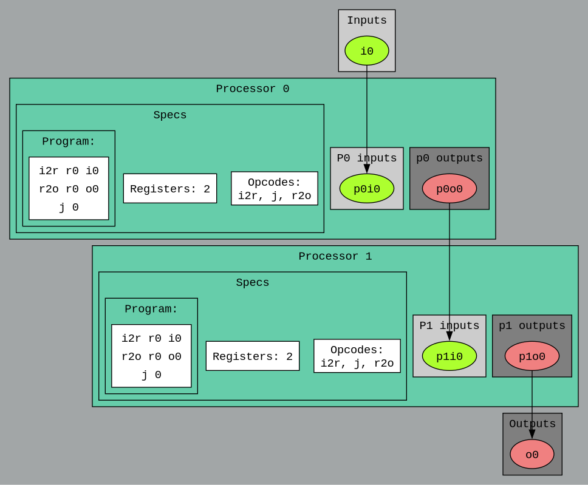

 # Basys3 Switch to LED Example
 
 This example demonstrates how to use BondMachine to create a simple architecture that reads the state of a switch on the Basys3 FPGA board and outputs it to an LED. The example is designed for the Basys3 board, but can be adapted to other boards with minor modifications.
The architecture is generated from a BASM file that defines via meta-attributes 2 processors, one that reads the switch state, pass along the value, and another that writes to the LED. 

The code of both processors is the same, it is contained in the `test.basm` file:
and is as follows:

```asm
%section code .romtext iomode:async
  entry _start    ; Entry point
_start:
  mov r0,i0
  mov o0,r0
  j _start
%endsection
```

The meta-attributes used are contained in the `test.bmeta` file and are as follows:

```asm
%meta cpdef	cpu1	romcode: code
%meta cpdef	cpu2	romcode: code
%meta bmdef	global  registersize:8, mapclk:clk, mapreset:btnC

%meta ioatt	testio3 cp: bm, index:0, type:output, mapfrom:0, mapto:7, mapname: led1
%meta ioatt	testio3 cp: cpu2, index:0, type:output

%meta ioatt	testio2 cp: cpu1, index:0, type:output
%meta ioatt	testio2 cp: cpu2, index:0, type:input

%meta ioatt	testio1 cp: bm, index:0, type:input, mapfrom:0, mapto:7, mapname: sw
%meta ioatt	testio1 cp: cpu1, index:0, type:input
```

Other files in this directory include the project's configuration files `local.mk` and `.config`, as well as the basys3 constraints file `basys3.xdc`.

The example can be summarized with the following diagram:



the example can be build and run using the following commands within the `basys3_switchled` directory:

```bash
make apply
make program
```

After programming the FPGA, you can toggle the switches (only the first 8 switches) on the Basys3 board, and the corresponding LED should light up according to the switch's state.
