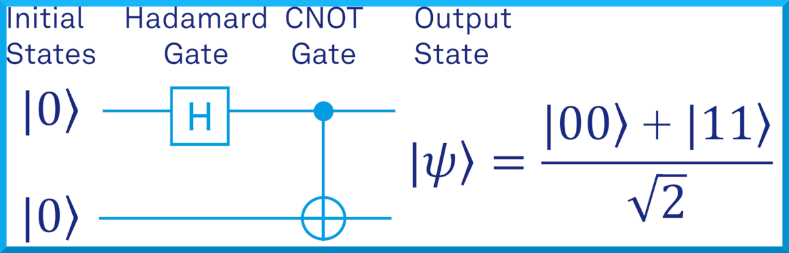

This example demonstrates how to use the ZedBoard and the BondMachine framework to generate a quantum circuit that prepares a Bell state. The Bell state is a maximally entangled state of two qubits. The circuit is then executed on the ZedBoard and the results are read back and displayed on the host machine.

The circuit of the Bell state is shown below:



The circuit consists of two qubits, q0 and q1. The Hadamard gate is applied to q0, followed by a CNOT gate with q0 as the control and q1 as the target. This translates to the following quantum circuit written in
bmq language:

```
%block code1 .sequential
	qbits	q0,q1
	zero	q0,q1
	h	q0
	cx	q0,q1
%endblock

%meta bmdef global main:code1
```

